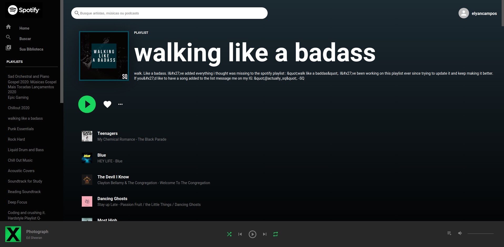

<h1 align="center">
  Spotify Clone
</h1>

  
  
  

  

  

  
  
  

  <a href="#-project">Project</a>&nbsp;&nbsp;&nbsp;|&nbsp;&nbsp;&nbsp;
  <a href="#features">Features</a>&nbsp;&nbsp;&nbsp;|&nbsp;&nbsp;&nbsp;
  <a href="#technology">Technology</a>&nbsp;&nbsp;&nbsp;|&nbsp;&nbsp;&nbsp; 
  <a href="#arrow_forward-how-to-run">How to run</a>&nbsp;&nbsp;&nbsp;|&nbsp;&nbsp;&nbsp; 

 

## 💻 Project

Spotify Clone developed with ReactJS and Spotify API. 

# Features

You can login with Spotify OAuth and it will load your playlists

## Technology

This project was developed with the following technologies:

- [ReactJS](https://reactjs.org/)
- [Spotify API](https://developer.spotify.com/)

## :arrow_forward: How to run

- In in your terminal run `yarn` or `npm` to install dependecies then run `yarn start` or `npm start`

---

Made By ♥ [Elian Campos](https://github.com/lyandeveloper). Add me on [LinkedIn](https://www.linkedin.com/in/elian-campos/) :wave:
